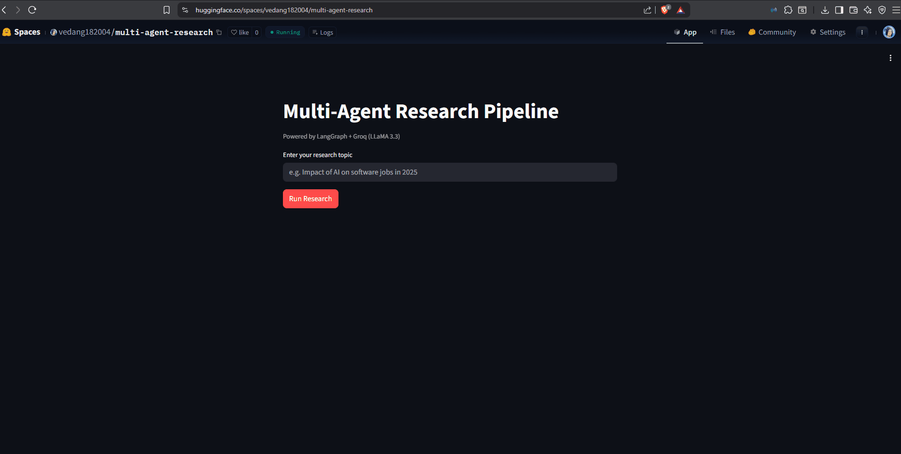

# 🔍 Multi-Agent Research Pipeline

> Automatically researches any topic using 4 specialized AI agents — plans, searches, writes, and verifies a cited report in under 2 minutes.


## 🚀 Live Demo

👉 [Try it here](https://huggingface.co/spaces/vedang182004/multi-agent-research)

## 📸 Demo



---

## 📌 What It Does

You type a research topic. Four AI agents collaborate to produce a structured, cited research report — automatically.

| Agent | Role |
|---|---|
| 🧠 **Supervisor** | Orchestrates the pipeline and manages agent routing |
| 📋 **Planner** | Breaks your query into 3–4 focused subtasks |
| 🔍 **Researcher** | Searches the web for each subtask using DuckDuckGo |
| ✍️ **Writer** | Synthesises all findings into a structured markdown report |
| ✅ **Verifier** | Scores the report for quality; retries if score is below threshold |

---

## 🏗️ Architecture

```
User Query
    │
    ▼
Supervisor Agent
    │
    ├──► Planner Agent     (breaks query into subtasks)
    │
    ├──► Researcher Agent  (web search per subtask)
    │
    ├──► Writer Agent      (synthesises report)
    │
    └──► Verifier Agent    (scores output, retries if < 0.75)
              │
              ▼
    Cited Research Report
```

Built with **LangGraph** — each agent is a node in a stateful graph. The shared `ResearchState` TypedDict flows through every node, so all agents have full context at every step.

---

## 🛠️ Tech Stack

| Layer | Technology |
|---|---|
| LLM | Groq API — `llama-3.3-70b-versatile` (free tier) |
| Agent Framework | LangGraph + LangChain |
| Backend API | FastAPI |
| Web Search | DuckDuckGo Search (no API key needed) |
| Frontend | Streamlit |
| Hosting — Backend | Render (free tier) |
| Hosting — Frontend | Hugging Face Spaces (free) |

**Total running cost: ₹0**

---

## 🚀 Quick Start

### 1. Clone the repo

```bash
git clone https://github.com/vedang18200/multi-agent-research
cd multi-agent-research
```

### 2. Install dependencies

```bash
pip install -r requirements.txt
```

### 3. Set up environment variables

```bash
cp .env.example .env
```

Edit `.env`:

```env
GROQ_API_KEY=your_groq_api_key_here
```

Get your free Groq API key at [console.groq.com](https://console.groq.com) — no credit card required.

### 4. Run the backend

```bash
uvicorn app.main:app --reload
```

API will be live at `http://localhost:8000`

### 5. Run the frontend

```bash
streamlit run frontend/app.py
```

Open `http://localhost:8501` in your browser.

---

## 📁 Project Structure

```
multi-agent-research/
├── app/
│   ├── main.py
│   ├── config.py
│   ├── api/
│   │   └── routes.py
│   ├── agents/
│   │   ├── supervisor.py
│   │   ├── planner.py
│   │   ├── researcher.py
│   │   ├── writer.py
│   │   └── verifier.py
│   ├── graph/
│   │   ├── state.py
│   │   └── pipeline.py
│   └── tools/
│       └── search.py
├── frontend/
│   └── app.py
├── tests/
│   └── test_pipeline.py
├── .env.example
├── requirements.txt
└── README.md
```

---

## 🌐 API Reference

### `POST /api/research`

Run the full multi-agent research pipeline.

**Request body:**
```json
{
  "query": "Impact of AI on software engineering jobs in 2025"
}
```

**Response:**
```json
{
  "report": "## Summary\n...",
  "sources": ["https://...", "https://..."],
  "confidence_score": 0.87,
  "subtasks": [
    "Current AI tools used by software engineers",
    "Job market trends for developers in 2025",
    ...
  ]
}
```

### `GET /health`

```json
{ "status": "ok" }
```

---
## 💡 Example Queries

- `Impact of AI on software jobs in India 2025`
- `Best practices for building LLM applications in production`
- `How does transformer attention mechanism work`
- `Latest advancements in multimodal AI models`

---

## 🔑 Key Concepts Demonstrated

- **Agentic workflows** — multiple specialised agents, each with a single responsibility
- **LangGraph state machines** — shared typed state flowing through graph nodes
- **Conditional edges** — retry loop when verifier confidence score is below threshold
- **Tool use** — researcher agent uses DuckDuckGo as an external tool
- **FastAPI + async backend** — production-ready REST API with Pydantic validation
- **Free LLM inference** — Groq's free tier with LLaMA 3.3 70B

---

## 👤 Author

**Vedang Deshmukh**
[LinkedIn](https://linkedin.com/in/vedang-deshmukh) · [GitHub](https://github.com/vedang18200)


